# FCDSN-DC
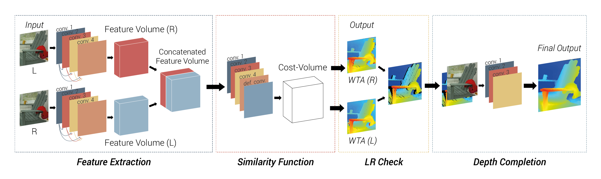
### An Accurate and Lightweight end-to-end Trainable Neural Network for Stereo Estimation with Depth Completion
Dominik Hirner, Friedrich Fraundorfer

An pytorch implementation of our accurate and lightweight end-to-end trainable CNN for stereo estimation with depth completion.
This method has been accepted and will be published at the **ICPR 2022** conference. If you use our work please cite our paper

The whole project is in pure python 3 and pytorch 1.2.0

A demo of the whole end-to-end method is available online in Google Colab: 
[Demo](https://colab.research.google.com/drive/10_QRckJdc19unydikcZIRZbTk_g1peHu?usp=sharing)

This repository contains

- jupyter notebooks for training and inference of disparity via a stereo-pair
- python3.6 code for training and inference
- trained weights for many publicly available datasets

### TODO
all scripts/notebooks tested for:
- [X] MB
- [ ] KITTI2012
- [ ] KITTI2015
- [ ] ETH

## Trained weights
Dataset | branch |  simB | Incons
:-------------------------:|:-------------------------:|:-------------------------:|:-------------------------:
Middlebury | [mb](https://drive.google.com/file/d/1Bo3INQhCK1N17EuLkX7nnie46zHeqrQ2/view?usp=sharing) | [mb_simB](https://drive.google.com/file/d/1jJG3ZfjBRIrWzN2MQZ1TxC_9JWMh2l64/view?usp=sharing) | [Incons](https://drive.google.com/file/d/11DNIJmpCTZpmwEC-rrKjRmoHaUEEma-C/view?usp=sharing) |
Kitti2012 | [kitti2012](https://drive.google.com/file/d/1mQtJsb8gesI_9Sy16SdXT_f_FgnKfdCP/view?usp=sharing) | [kitti2012_simB](https://drive.google.com/file/d/1mcxjhUZO6JuokMHLSkq3Q6psdBATOJBJ/view?usp=sharing) | [Icons_KITTI2012](https://drive.google.com/file/d/1SwSke9euif9Kfa4qPRBW7TZwA3z555lv/view?usp=sharing) | 
Kitti2015 | [kitti2015](https://drive.google.com/file/d/1wY6h1D89e_Mx9aOFSab3FxedDn0n6WiP/view?usp=sharing) | [kitti2015_simB](https://drive.google.com/file/d/1tQRzwjeUE16WS9V2U9P_YHw5fMuVJ7uE/view?usp=sharing) | [Incons_KITTI2015](https://drive.google.com/file/d/1L5QcqW5Ph9gmFpqV1rlMW0-pkINM3y4I/view?usp=sharing) | 

## Examples
RGB             |  Disparity
:-------------------------:|:-------------------------:
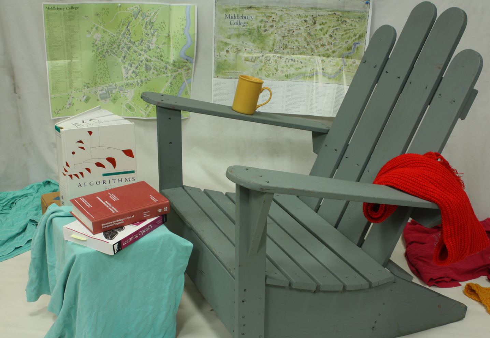  |  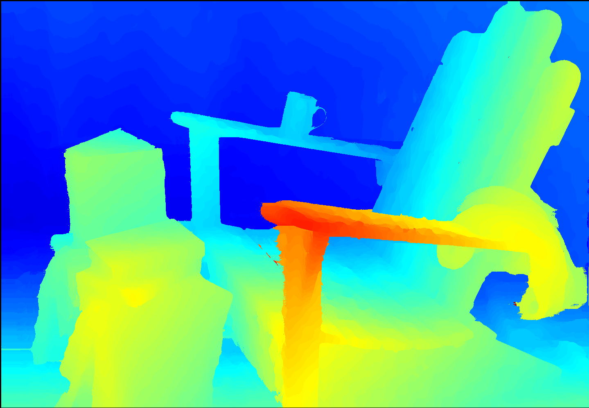 |
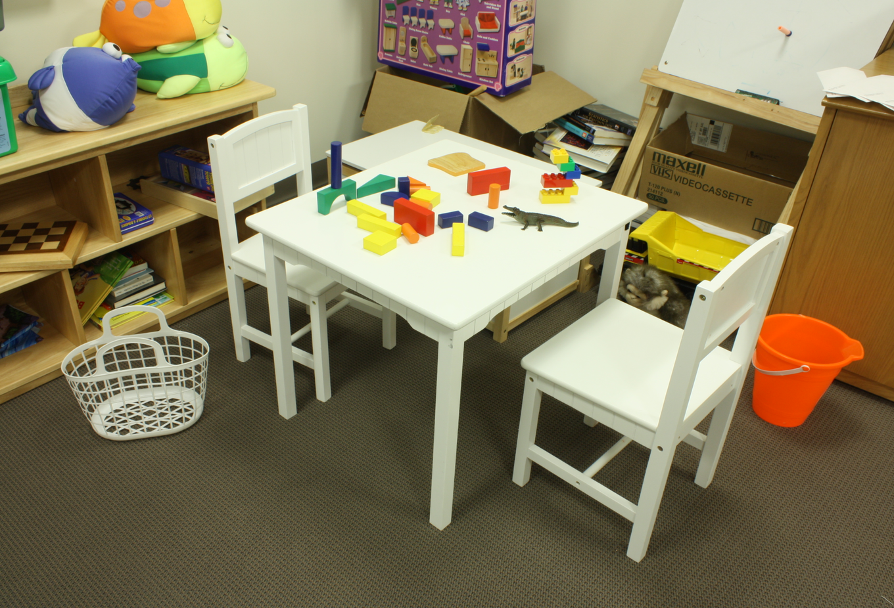  |   |
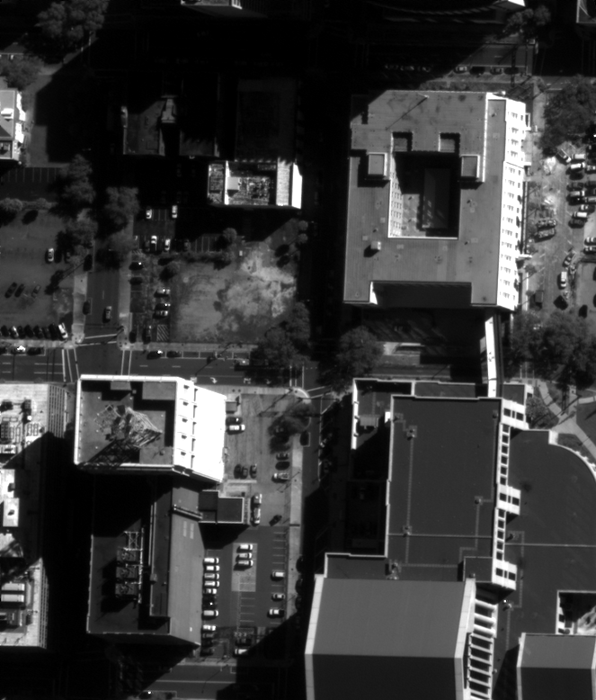  |  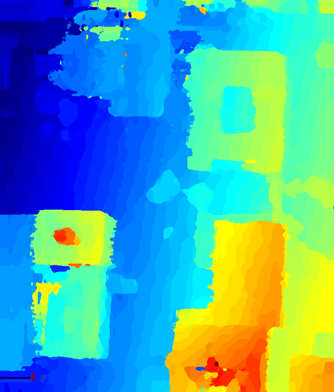 |
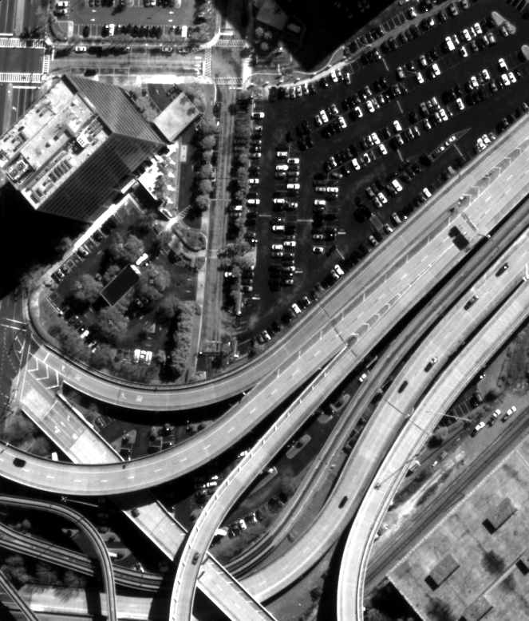  |  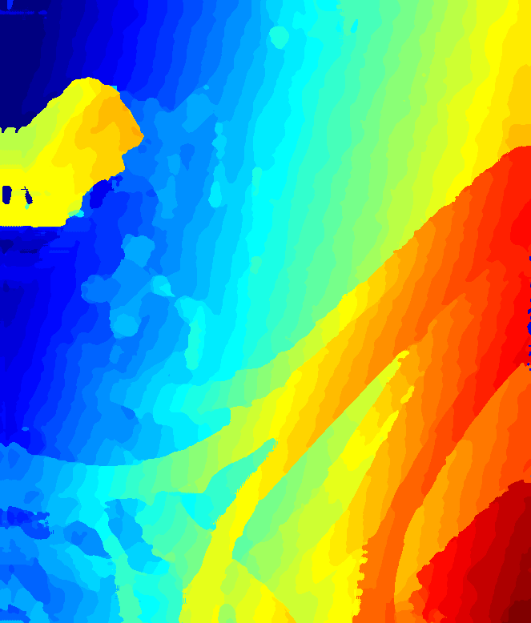 |
  |  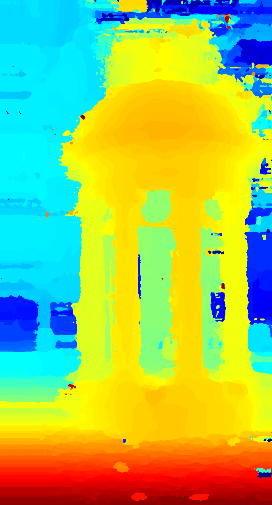 |
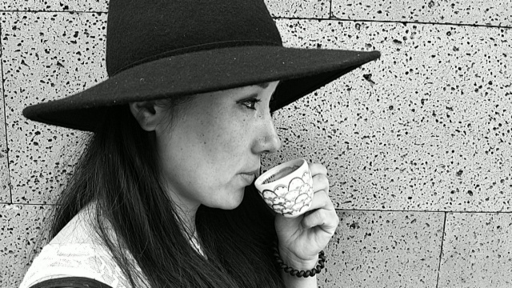  |  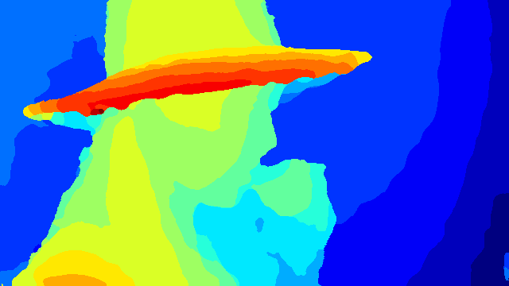 |
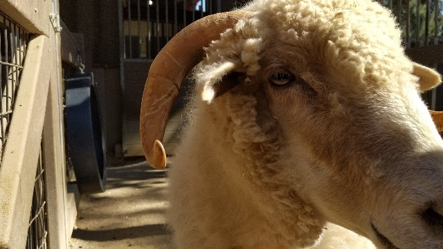  |  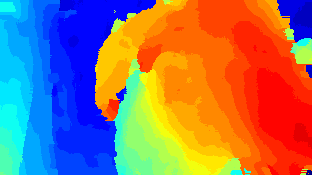 |

