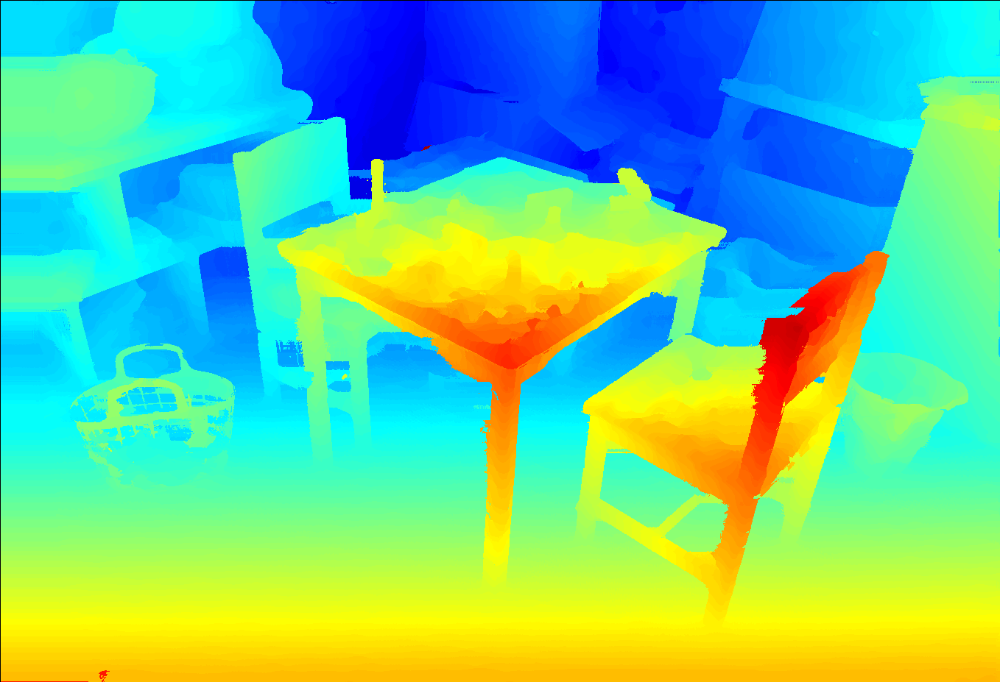

# FCDSN-DC

### An Accurate and Lightweight end-to-end Trainable Neural Network for Stereo Estimation with Depth Completion
Dominik Hirner, Friedrich Fraundorfer

An pytorch implementation of our accurate and lightweight end-to-end trainable CNN for stereo estimation with depth completion.
This method has been accepted and will be published at the **ICPR 2022** conference. If you use our work please cite our paper

The whole project is in pure python 3 and pytorch 1.2.0

This repository contains

- jupyter notebooks for training and inference of disparity via a stereo-pair
- python3.6 code for training and inference
- trained weights for many publicly available datasets

### TODO
all scripts/notebooks tested for:
- [X] MB
- [ ] KITTI2012
- [ ] KITTI2015
- [ ] ETH

## Examples
RGB             |  Disparity
:-------------------------:|:-------------------------:
  |   |
  |   |
  |   |
  |   |
  |   |
  |   |
  |   |

